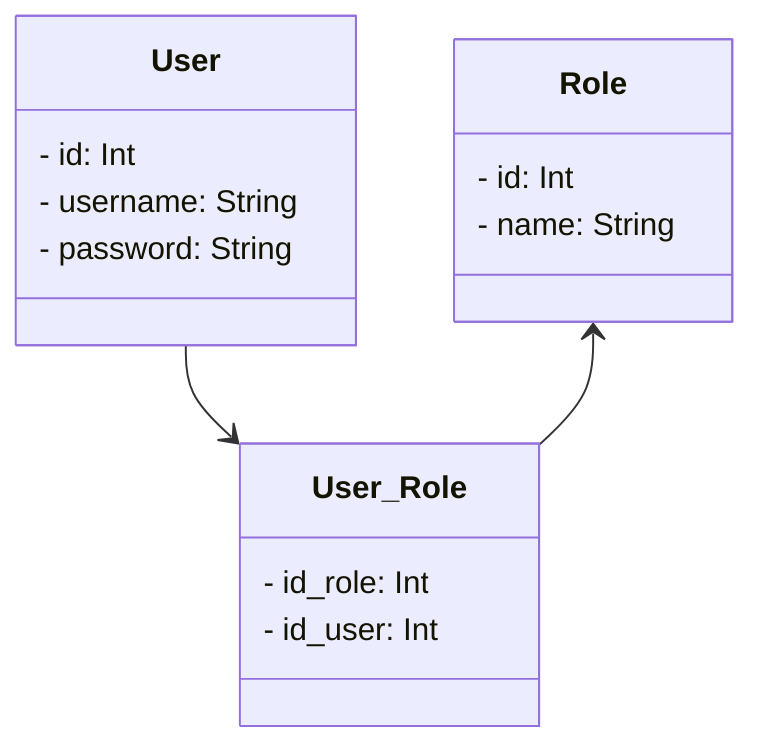

```mermaid
classDiagram
    class User {
        - id: Int
        - username: String
        - password: String
    }

    class User_Role {
        - id_role: Int
        - id_user: Int
    }

    class Role {
        - id: Int
        - name: String
    }

    User --> User_Role
    Role <-- User_Role
```